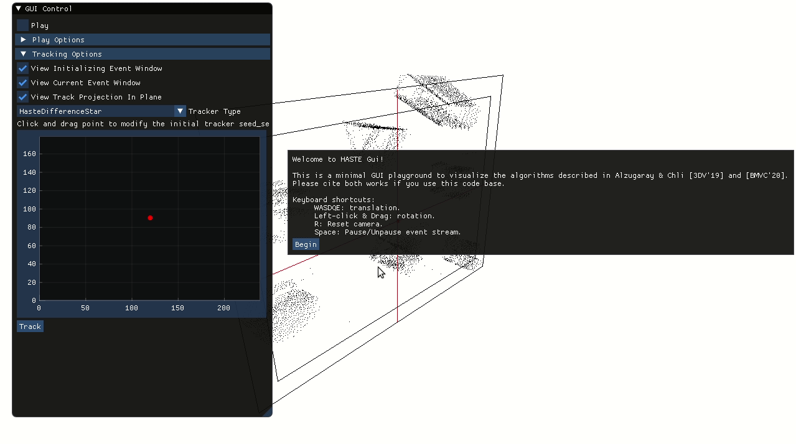

# Hypotheses-based Asynchronous Feature Tracking for Event Cameras
This repo contains the implementation of the tracking algorithms described in the following papers:
**[Asynchronous Multi-Hypothesis Tracking of Features with Event Cameras, [3DV'19] ](https://doi.org/10.3929/ethz-b-000360434)** and **[HASTE: multi-Hypothesis Asynchronous Speeded-up Tracking of Events, [BMVC'20] ](https://www.bmvc2020-conference.com/conference/papers/paper_0744.html)** by Alzugaray & Chli. This research is conducted at the [Vision for Robotics Lab](http://v4rl.ethz.ch/), [ETH Zurich](http://ethz.ch/).

Events cameras only capture small incremental intensity changes in form of asynchronous events.
Sparsity and asynchronicity are characteristics of the event-stream that are explicitly exploited in the proposed algorithms. 
We present a set of novel methodologies that enable the efficient, asynchronous tracking of features using event-by-event processing.
We rely on a new hypothesis-based paradigm for event algorithms that avoids the need to explicitly optimizing the underlying expensive alignment problem in this particular application.

## Citations
If you use this code, please cite the following works:

**[Asynchronous Multi-Hypothesis Tracking of Features with Event Cameras, [3DV'19]](https://doi.org/10.3929/ethz-b-000360434)**

[[Paper]](https://doi.org/10.3929/ethz-b-000360434)
[[Video]](https://youtu.be/eguV_AIbteU)

<a href="https://youtu.be/eguV_AIbteU" target="_blank"></a>

    @INPROCEEDINGS{alzugaray:3DV19,
    author={I. {Alzugaray} and M. {Chli}},
    booktitle={2019 International Conference on 3D Vision (3DV)},
    title={Asynchronous Multi-Hypothesis Tracking of Features with Event Cameras},
    year={2019},
    pages={269-278},
    doi={10.1109/3DV.2019.00038}
    }

**[HASTE: multi-Hypothesis Asynchronous Speeded-up Tracking of Events, [BMVC'20]](https://www.bmvc2020-conference.com/conference/papers/paper_0744.html)**

[[Paper]](https://www.bmvc2020-conference.com/assets/papers/0744.pdf)
[[Presentation]](https://www.bmvc2020-conference.com/conference/papers/paper_0744.html)
[[Video]](https://youtu.be/6DZxIzrVLcI)

<a href="https://youtu.be/6DZxIzrVLcI" target="_blank"></a>

    @inproceedings{alzugaray:BMVC20,
    author={I. {Alzugaray} and M. {Chli}},
    title     = {{HASTE:} multi-Hypothesis Asynchronous Speeded-up Tracking of Events},
    booktitle = {31st British Machine Vision Conference 2020, {BMVC} 2020},
    publisher = {{BMVA} Press},
    year      = {2020},
    url       = {https://www.bmvc2020-conference.com/assets/papers/0744.pdf},
    }

#  Disclaimer and License
This is research code and you should expect regular updates.
Please always use the latest version for comparison.
Any fitness for a particular purpose is disclaimed. 
The source code is released under MIT License.

#  Instructions
We provide two examples apps: 
a stand-alone version intended for high-performance benchmarking and a GUI version as a playground to visualize on how the different algorithms work.

Note that the presented apps are minimal code examples for guidance in how to use the proposed algorithms. 
As described in the papers, we only propose a set of tracking methodologies and not a full front-end tracking system. 
The final user would need to define how to detect a feature to track, when to discard a failing tracker, etc.
The extension and adaptation of the provided code is not only encouraged for any particular application, but necessary for a fair comparison against other methods.

The provided apps are meant to work with plain text files in the format specified in the [Event Camera Dataset](http://rpg.ifi.uzh.ch/davis_data.html).
In order to run the following examples, you can download an example dataset [here](http://rpg.ifi.uzh.ch/datasets/davis/shapes_translation.zip).
**DISCLAIMER**: Please DO use event-files with rebased initial timestamp (e.g. the first event is timestamped at 0s); avoid using raw Unix time as it will cause malfunction.

### Dependencies
The code has been tested under Ubuntu 18.04.

Minimum dependencies requirements:
* [OpenCV >= v3.2](https://docs.opencv.org/master/d7/d9f/tutorial_linux_install.html)
* [Eigen >= v3.4 ](https://eigen.tuxfamily.org/dox/). **Warning**. Please use the most recent version from repo (distributed as submodule).
* [GFLAGS](https://github.com/gflags/gflags). `$ sudo apt-get install libgflags-dev`
* [GLOG](https://github.com/google/glog).


(Optional) GUI dependencies requirements:
* OpenGL / GLFW / GLEW3. `$ sudo apt-get mesa-utils libglfw3-dev`

### Building
Only stand-alone benchmarking app: 

    $ git clone https://github.com/ialzugaray/haste.git
    $ git submodule update --init --recursive
    $ mkdir -p haste/build && cd haste/build
    $ cmake .. -DCMAKE_BUILD_TYPE=Release -DGUI=false
    $ make

Stand-alone benchmarking and GUI apps:

    $ git clone https://github.com/ialzugaray/haste.git
    $ git submodule update --init --recursive
    $ mkdir -p haste/build && cd haste/build
    $ cmake .. -DCMAKE_BUILD_TYPE=Release -DGUI=true
    $ make


### GUI app
To run the GUI app on an [example dataset](http://rpg.ifi.uzh.ch/datasets/davis/shapes_translation.zip), execute the following command:

    $ ./tracking_app_gui --events_file=path/to/dataset/events.txt --camera_params_file=path/to/dataset/calib.txt

While `--events_file` is the only required flag, you can find all other possible flags and their detailed explanation running the following command: `$ ./tracking_app_gui --usage`



### Stand-alone Benchmarking app
To run the stand-alone benchmarking app on an [example dataset](http://rpg.ifi.uzh.ch/datasets/davis/shapes_translation.zip), execute the following command to generate originate a single tracker:
```
./tracking_app_file --events_file=path/to/dataset/events.txt        `# Load events from specified file.`\
                    --camera_params_file=path/to/dataset/calib.txt  `# Apply undistortion as pre-processing step.`\
                    --seed=0.6,125.0,52.0,0.0,0                     `# Seed tracker #0 at 0.6s, in (125.0,52.0) pixel coordiates with initial orientation 0 degrees.`'\
                    --centered_initialization=false                 `# Do not enforce centered initialization. Track will start arbitrarily later than seed.`'\
                    --tracker_type=haste_correlation_star           `# Employed tracker is HasteCorrelation*.`\
                    --visualize=false                               `# Show intermediate tracking states as images.`
```

Several flags control this app (you can find them all and their detailed explanation running `./tracking_app_file --usage`):
* `--events_file=events/file/path`is *required* and specifies the path from which the events would be loaded.
* `--tracker_type=correlation` is *required* and specifies the employed tracker (`correlation`,`haste_correlation`,`haste_correlation_star`,`haste_difference`,`haste_difference_star`). Only `correlation` is described in [3DV'19](https://doi.org/10.3929/ethz-b-000360434), whereas others are described in  [BMVC'20](https://www.bmvc2020-conference.com/conference/papers/paper_0744.html).
  
* `--camera_params_file=camera/file/path` specifies the path from which the camera parameters and distortion would be loaded. If specified it would apply undistortion to all the events in the stream as a preprocessing step.
* `--visualize=true` shows trackers internal state. 
* `--seed=t,x,y,theta,id` and `--centered_initialization=false` manually specify the originating seed of the individual tracker and it would regularly initialized arbitrarily later in time(see below).

The trackers are originated in what is referred to as a `seed`. After several events are accumulated (equal to the event window size) within the tracker's range, the tracker gets fully initialized (which may occur arbitrarily later than the specified originating seed).  
To avoid this,  `--centered_initialization=true` can be specified so that half of the initial events are accumulated preceding the originating seed, enforcing that the first initial state of the tracker to be as close as possible to the originating seed.
When selecting the seed of a tracker, make sure it is spatio-temporally surrounding by events so that the ill-posed initialization of the tracker is prevented.


Alternatively, multiple seeds can be loaded from a file using the following command:
```
./tracking_app_file --events_file=path/to/data/events.txt           `# Load events from specified file.`\
                    --camera_params_file=path/to/data/calib.txt     `# Apply undistortion as pre-processing step.`\
                    --num_events=4000000                            `# Load only the first 4M events from file.`'\
                    --centered_initialization=false                 `# Do not enforce centered initialization. Track will start arbitrarily later than seed.`'\
                    --tracker_type=haste_correlation_star           `# Employed tracker is HasteCorrelation*.`\
                    --seeds_file=path/to/seeds_file.txt             `# Seeds read from specified file.`\
                    --output_file=path/to/tracking_result_file.txt  `# Specify file where tracking states will be recorded.`\
                    --visualize=false                               `# Do not show intermediate tracking states as images.`
```


The `--seeds_file` is to be formatted as follows (see [example seeds file](examples/example_seeds_file.txt)) , where each line represents an originating seed for a tracker with an specified id.
```
t1,x1,y1,theta1,id1
t2,x2,y2,theta2,id2
...
```

Setting `--output_file=path/to/output/file`, the states of each individual tracker are dumped into a file in which each line is formatted as `t,x,y,theta,id`. This can be directly used for benchmarking the quality of tracking.
Note that, in the provided minimal examples, the features are naively tracked until they leave the FOV of the camera, regardless of the on-going quality of the tracking. 
Depending on the application, the user might want to consider more robust strategies such as consensus among tracks (e.g. RANSAC) or removing those tracks whose hypothesis score is low.
These tracking stopping conditions are being purposely left unimplemented since they depend on the final application whereas we only present a set of tracking methodologies. 
Please use an appropriate stopping condition when comparing against other methods.

After the processing of all the seeds has been completed which, in this example app, occurs sequentially, a brief summary about the processing time would be presented.
When collecting these timings results for comparison, make sure to deactivate the visualization of the internal states `--visualize=false` and leave the `--output_file` unspecified, since using any of those could negatively affect the benchmarked time.

# Troubleshoot
* **All resulting tracking states in Stand-alone App have the same timestamp /
There are no events showing in GUI App**: 
  - Make sure you are using event files with rebased timestamp, i.e. the first event in the stream is timestamped in the order of 0s. Using the traditional UNIX time for events 
    (each event is timestamped in the order of 1e9s) would cause malfunction due to the (intended) lack of data precission in the current implementation.
    
# Contact
Please, create an issue if you have questions or bug reports. If you come up with any improvements, please create a pull request.
If you want to discuss about this research or potential collaborations, you can also contact me at ialzugaray(at)mavt.ethz.ch or alzugaray.ign(at)gmail.com .


